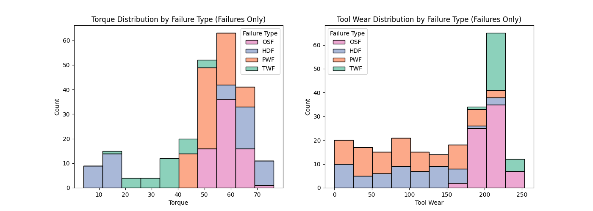
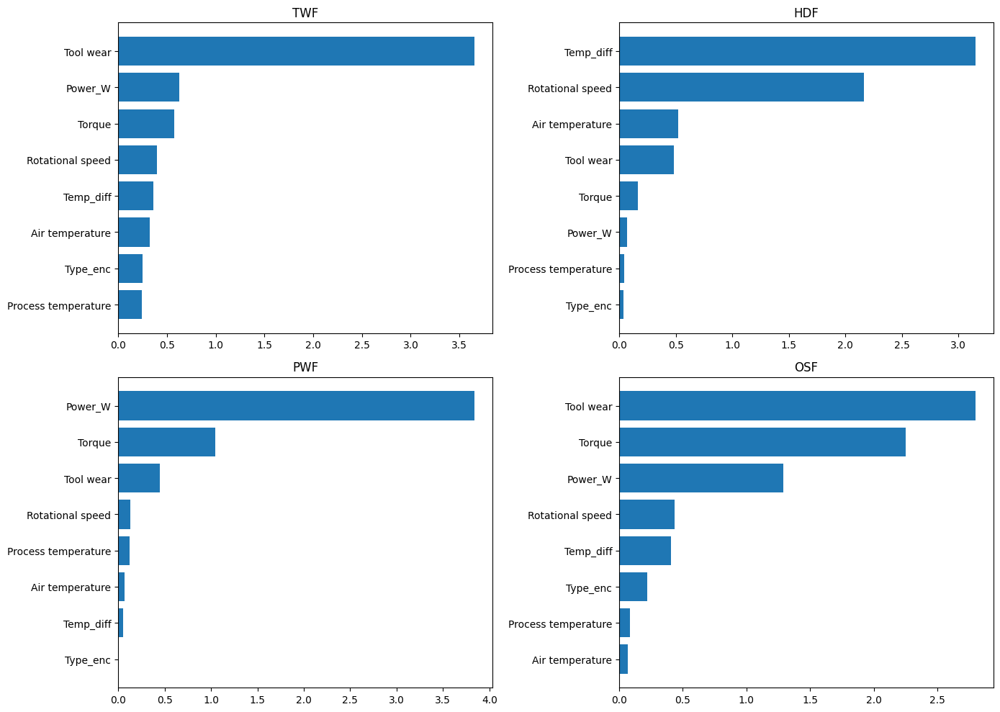

# Predictive Maintenance MLOps Pipeline

## Problem Statement
Predict industrial machine failures using sensor data and build a production-style MLOps workflow.

## Objective
The goal is not only classification accuracy, but a complete ML lifecycle:
- Data validation
- Experiment tracking
- Model selection
- Monitoring
- Explainability
- Retraining decisions

## Tech Stack

- Python
- Pandas / NumPy
- Scikit-learn
- XGBoost
- LightGBM
- MLflow
- Optuna
- Evidently AI
- SHAP
- Pandera

## Workflow

### 1. Data Validation & EDA
- Schema validation using Pandera
- Class imbalance analysis
- Feature engineering:
  - Power_W
  - Temp_diff

### 2. Model Development
Models compared:
- Logistic Regression
- Random Forest
- XGBoost
- LightGBM

Selection metric:
Macro F1 score

### 3. Experiment Tracking

MLflow used for:
- Parameters
- Metrics
- Model artifacts
- Model registry

### 4. Monitoring

Evidently AI used to compare:
- Stable production batch
- Drifted stress batch

### 5. Explainability

SHAP analysis performed to identify sensor drivers for each failure class.

## Exploratory Data Analysis

Class imbalance and sensor distribution analysis.

## Model Explainability - SHAP Analysis

SHAP was used to interpret the tuned model predictions for each failure class.

## Data Drift Monitoring

Evidently AI reports were generated to monitor production data drift.

- [Stable Production Batch Drift Report](artifacts/drift_current.html)
- [Stress Batch Drift Report](artifacts/drift_stress.html)

## Key Learning

Valid data can still drift after deployment.  
Production ML requires continuous monitoring and retraining decisions.